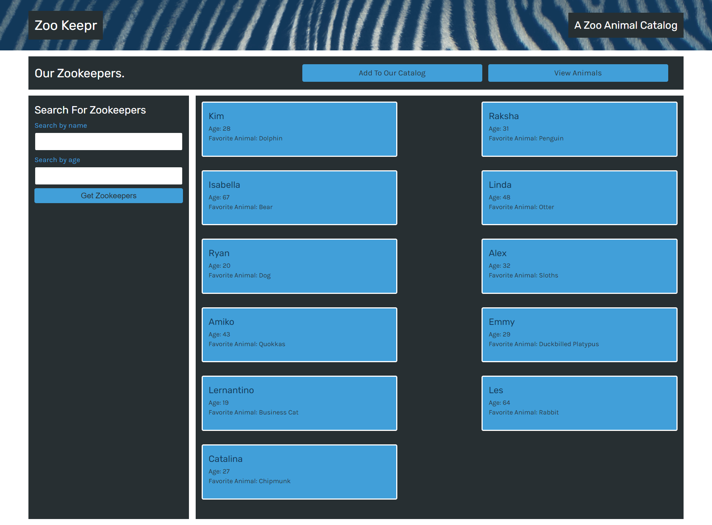

# Zoo Keepr

## Application Description
This is an application creating a web server for a fictional zoo to view information about animals and about zoo keepers and to add new entries to either dataset through API calls. Basic HTML and CSS were provided and modified as needed to create the application functionality.

## Tools Used
* HTML
* CSS
* JavaScript ES5 and ES6
* Node.js
* Express.js
* AJAX
* Insomnia (https://insomnia.rest/)
* Heroku (https://dashboard.heroku.com/)

## Deployed application
This application is hosted for free on Heroku at: https://polar-forest-79901.herokuapp.com/  
Functionality can be tested, and new data will be retained for an indeterminate period of time.  When Heroku restarts the dyno, any new data will be lost.

## Screenshot

